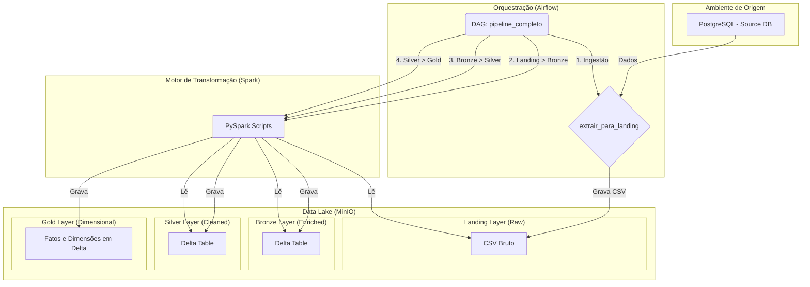

# Pipeline de Dados com Airflow, Spark e Delta Lake

## 📜 Visão Geral do Projeto

Este projeto implementa um pipeline de dados completo e moderno, construído para atender aos requisitos do trabalho final da disciplina de Engenharia de Dados. O pipeline orquestra a ingestão, transformação e armazenamento de dados seguindo as melhores práticas de mercado, como a arquitetura medalhão e o uso de ferramentas open-source robustas.

O fluxo de dados simula um ambiente de e-commerce, partindo de um banco de dados relacional de origem, passando por um Data Lake em object storage, e finalizando em um modelo dimensional pronto para ser consumido por ferramentas de Business Intelligence.

---

## 🏛️ Arquitetura

A arquitetura do projeto é baseada em contêineres Docker e segue o padrão da arquitetura medalhão para o tratamento dos dados no Data Lake.



---

## 🛠️ Tecnologias Utilizadas

- **Orquestração:** Apache Airflow
- **Motor de Transformação:** Apache Spark (PySpark)
- **Data Lake Storage:** MinIO (Object Storage S3-compatible)
- **Formato dos Dados:** Delta Lake
- **Banco de Dados de Origem:** PostgreSQL
- **Containerização:** Docker & Docker Compose
- **Documentação:** MkDocs

---

## 🚀 Como Configurar e Executar o Projeto

Siga os passos abaixo para configurar e executar o ambiente completo do pipeline de dados.

### Pré-requisitos

- Git
- Docker
- Docker Compose

### 1. Clonar o Repositório

```sh
git clone https://github.com/Luan-zanardo/data-pipeline.git
cd data-pipeline
```

### 2. Configurar Variáveis de Ambiente

O projeto utiliza um arquivo `.env` para gerenciar as credenciais. Crie o seu a partir do arquivo de exemplo:

```sh
cp .env.example .env
```
> **Nota:** As configurações padrão no `.env.example` já estão ajustadas para o ambiente Docker local e não precisam de alteração para uma execução padrão.

### 3. Construir e Iniciar os Contêineres

Este comando irá construir a imagem customizada do Airflow (com Java e dependências) e iniciar todos os serviços (Airflow, Spark, MinIO, PostgreSQL).

```sh
docker-compose up -d --build
```

### 4. Acessar o Airflow e Executar o Pipeline

1.  **Acesse a UI do Airflow:** Abra seu navegador e acesse `http://localhost:8080`.
2.  **Login:** Use o usuário `admin` e a senha `admin` (ou o que estiver configurado no seu `.env`).
3.  **Ative e Execute a DAG:**
    - Encontre a DAG `pipeline_completo` na lista.
    - Ative-a clicando no botão de toggle.
    - Clique no botão "Play" (▶️) para acionar uma nova execução (Run).

Na primeira execução, a tarefa `setup_ambiente_origem` irá popular o banco de dados de origem com 100.000 registros. Isso pode levar alguns minutos. Nas execuções seguintes, essa etapa será pulada, e o pipeline executará apenas a lógica de ingestão e transformação incremental.

---

## 📂 Estrutura do Projeto

```
.
├── dags/                 # Definições das DAGs do Airflow
│   └── pipeline_completo.py
├── src/                  # Código fonte do projeto
│   ├── ingestion/        # Lógica de ingestão da origem para a Landing
│   ├── spark/            # Scripts PySpark para as transformações
│   └── setup.py          # Lógica para popular o banco de origem
├── datalake/             # (Local) Mount para o Data Lake (não versionado)
├── docs/                 # Arquivos da documentação MkDocs
├── .env.example          # Exemplo de arquivo de configuração
├── docker-compose.yml    # Orquestração dos serviços Docker
├── Dockerfile            # Imagem customizada do Airflow
└── mkdocs.yml            # Configuração do MkDocs
```

---

## 📄 Licença

Este projeto está sob a licença MIT. Veja o arquivo `LICENSE` para mais detalhes.
