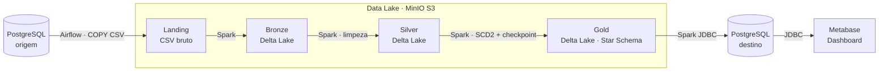

> Trabalho final da disciplina de **Engenharia de Dados** — curso de Engenharia de Software, **UNISATC**.

📖 **Documentação completa (MkDocs):** <https://Luan-zanardo.github.io/data-pipeline/>

---

## 📜 Visão Geral

Este projeto implementa um **pipeline de dados de ponta a ponta**, construído sobre a **arquitetura medalhão** (Landing → Bronze → Silver → Gold) e ferramentas open-source consolidadas no mercado.

O fluxo simula um ambiente de **e-commerce**: parte de um banco relacional de origem, atravessa um Data Lake em *object storage* e termina em um **modelo dimensional (esquema estrela)** pronto para ser consumido por uma ferramenta de Business Intelligence.

Os requisitos do trabalho são atendidos integralmente: 10 tabelas de origem com 10 mil+ linhas e 3 anos de histórico, orquestração sem `cron`/Agendador do SO, Data Lake sobre *object storage*, gravação em **Delta Lake**, transformação com **Apache Spark**, dimensões em **SCD Tipo 2**, fatos com **carga incremental por checkpoint** e dashboard final.

---

## 🏛️ Arquitetura



O ambiente roda inteiramente em **contêineres Docker**, orquestrados pelo Apache Airflow.

---

## 🧰 Stack e ferramentas

| Camada | Ferramenta |
| ------ | ---------- |
| Banco de origem / destino | **PostgreSQL** (origem em Supabase) |
| Orquestração | **Apache Airflow** 2.10 (LocalExecutor, em Docker) |
| Object storage / Data Lake | **MinIO** (compatível com S3) |
| Processamento (ETL) | **Apache Spark / PySpark** 3.5 |
| Formato das camadas | **Delta Lake** 3.2 (Bronze, Silver, Gold) |
| Geração de massa | **Python + Faker** |
| Visualização (BI) | **Metabase** (self-host) |
| Documentação | **MkDocs + Material** |
| Containerização | **Docker + Docker Compose** |

---

## 📂 Estrutura do repositório

```text
data-pipeline/
├── dags/                     # DAG do Airflow (pipeline_completo)
├── datalake/landing/         # camada Landing local (object storage / MinIO em prod)
├── docs/                     # documentação MkDocs (este site)
├── src/
│   ├── ingestion/            # extração da origem → Landing (CSV)
│   ├── spark/                # jobs PySpark: landing→bronze→silver→gold
│   └── serving/              # virtualização da Gold no Postgres de destino
├── docker-compose.yml        # Airflow + Postgres + MinIO + Metabase
├── Dockerfile                # imagem customizada do Airflow
├── mkdocs.yml                # configuração da documentação
├── requirements.txt
└── .env.example              # modelo de variáveis de ambiente
```

---

## 🚀 Como executar

Há dois caminhos — detalhados em [Setup do Ambiente](docs/setup.md) e [Como Executar](docs/como-executar.md).

### Pré-requisitos

- **Git**, **Docker** e **Docker Compose**
- (Caminho local) **Python 3.10+** e **Java 8/11** para o Spark

### 1. Clonar e configurar

```bash
git clone https://github.com/Luan-zanardo/data-pipeline.git
cd data-pipeline
cp .env.example .env          # preencha as credenciais
```

### 2. Subir o ambiente (caminho orquestrado)

```bash
docker compose up -d --build
```

Sobe `airflow-webserver`, `airflow-scheduler`, `postgres-source`, `minio` e `metabase`.

### 3. Rodar o pipeline

1. Acesse o Airflow em <http://localhost:8080> (usuário/senha: `admin`/`admin`).
2. Ative e dispare a DAG **`pipeline_completo`**.
3. Acompanhe a jornada Landing → Bronze → Silver → Gold → Postgres de destino.
4. Visualize os resultados no **Metabase** em <http://localhost:3000>.

> A primeira execução popula o banco de origem (100 mil registros) e pode levar alguns minutos. A tarefa é **idempotente**: execuções seguintes detectam que os dados já existem.

---

## 📊 Dashboard — KPIs e métricas

Construído no **Metabase** sobre o modelo dimensional da camada Gold:

- **KPIs:** receita total, número de pedidos, ticket médio e total de clientes ativos.
- **Métricas:** vendas por período (`dim_data`) e top clientes/produtos (`dim_cliente` × `dim_produto`).

A demonstração inclui a **carga incremental**: ao rodar o pipeline novamente, apenas os registros novos entram na fato (via checkpoint) e as mudanças nas dimensões geram novas versões (SCD-2).

---

## 📚 Documentação (MkDocs)

A documentação completa é publicada com **MkDocs Material** (modo claro/escuro, navbar fixa e foco em acessibilidade).

```bash
pip install -r requirements.txt

mkdocs serve        # preview local em http://127.0.0.1:8000
mkdocs build        # gera o site estático (HTML/CSS/JS)
mkdocs gh-deploy    # publica no GitHub Pages
```

---

## 🤝 Colaboração

O repositório segue um fluxo baseado em **Pull Requests** — a branch `main` é protegida e não aceita commits diretos.

1. Abra uma **issue** descrevendo a tarefa.
2. Crie um branch: `git checkout -b feature/nome-da-feature`.
3. Faça commits seguindo o padrão [Conventional Commits](https://www.conventionalcommits.org/pt-br/v1.0.0/).
4. Abra um **Pull Request** para `main` e aguarde revisão/aprovação.
5. Cada etapa do trabalho está mapeada como **issue** no GitHub.

---

## 👥 Autores

Trabalho em grupo com avaliação individual. Responsabilidades por etapa:

| Etapa | Responsável |
| ----- | ----------- |
| Data Lake Base | [@minattinho](https://github.com/minattinho) |
| Origem dos Dados e Geração de Massa | [@AmonAmarth2003](https://github.com/AmonAmarth2003) |
| Orquestração e Camada Landing | [@p-afonso](https://github.com/p-afonso) |
| Transformação Spark (Bronze e Silver) | _Grupo_ |
| Modelagem, Carga Incremental e Gold | _Grupo_ |
| Dataviz com Metabase | [@Luan-zanardo](https://github.com/Luan-zanardo) |
| Documentação, Apresentação e Entrega | [@gabrielpagnan](https://github.com/gabrielpagnan) · [@Lorenbou](https://github.com/Lorenbou) |

---

## 📄 Licença

Distribuído sob a licença **MIT**. Veja o arquivo [LICENSE](LICENSE) para detalhes.

---

## 🔗 Referências

**Arquitetura e modelagem**

- Databricks — [Medallion Architecture](https://www.databricks.com/glossary/medallion-architecture)
- Kimball Group — [Dimensional Modeling Techniques](https://www.kimballgroup.com/data-warehouse-business-intelligence-resources/kimball-techniques/dimensional-modeling-techniques/)
- Kimball Group — [Slowly Changing Dimensions (Type 2)](https://www.kimballgroup.com/2008/08/slowly-changing-dimensions-part-1/)

**Ferramentas**

- [Apache Airflow — Documentação](https://airflow.apache.org/docs/)
- [Apache Spark / PySpark — Documentação](https://spark.apache.org/docs/latest/api/python/)
- [Delta Lake — Documentação](https://docs.delta.io/latest/index.html)
- [MinIO — Documentação](https://min.io/docs/minio/container/index.html)
- [Metabase — Documentação](https://www.metabase.com/docs/latest/)
- [Faker — Documentação](https://faker.readthedocs.io/)
- [Docker Compose — Documentação](https://docs.docker.com/compose/)

**Documentação e versionamento**

- [MkDocs](https://www.mkdocs.org/) · [Material for MkDocs](https://squidfunk.github.io/mkdocs-material/)
- [Conventional Commits](https://www.conventionalcommits.org/pt-br/v1.0.0/)
- Repositório modelo da disciplina — [jlsilva01/projeto-ed-satc](https://github.com/jlsilva01/projeto-ed-satc)
