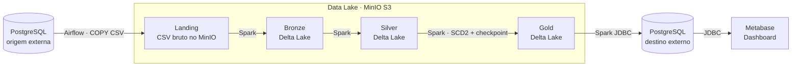

> Trabalho final da disciplina de **Engenharia de Dados** — curso de Engenharia de Software, **UNISATC**.

📖 **Documentação completa (MkDocs):** <https://Luan-zanardo.github.io/data-pipeline/>

---

## 📜 Visão Geral

Este projeto implementa um pipeline de dados em arquitetura medalhão
(Landing → Bronze → Silver → Gold), usando Airflow, MinIO, Spark, Delta Lake,
PostgreSQL e Metabase.

O domínio simulado é um e-commerce. A DAG `pipeline_completo` prepara o banco
de origem quando ele está vazio, extrai as tabelas para a Landing em CSV,
converte os dados para Delta Lake nas camadas Bronze/Silver/Gold, carrega a
Gold em um PostgreSQL de destino e provisiona o Metabase para consumo analítico.

---

## 🏛️ Arquitetura



O `docker-compose.yml` sobe Airflow, MinIO e Metabase. Os bancos PostgreSQL de
origem e destino são configurados por variáveis `SOURCE_DB_*` e `DEST_DB_*`;
eles não são criados como serviços locais pelo Compose.

---

## 🧰 Stack e ferramentas

| Camada | Ferramenta |
| ------ | ---------- |
| Banco de origem / destino | PostgreSQL externo |
| Orquestração | Apache Airflow 2.10.5 (LocalExecutor, em Docker) |
| Object storage / Data Lake | MinIO (compatível com S3) |
| Processamento | Apache Spark / PySpark 3.5 |
| Formato das camadas | Delta Lake 3.2 |
| Geração de massa | Python + Faker (`src/setup.py`) |
| Visualização | Metabase self-host |
| Documentação | MkDocs + Material |
| Containerização | Docker + Docker Compose |

---

## 📂 Estrutura do repositório

```text
data-pipeline/
├── dags/                     # DAG pipeline_completo
├── datalake/landing/         # diretório versionado apenas com .gitkeep
├── docs/                     # documentação MkDocs
├── scripts/                  # provisionamento do Metabase
├── src/
│   ├── ingestion/            # extração da origem para a Landing
│   ├── spark/                # jobs Spark de transformação e validação
│   └── serving/              # carga da Gold no Postgres de destino
├── .env.example              # modelo de variáveis de ambiente
├── docker-compose.yml
├── Dockerfile
├── mkdocs.yml
└── requirements.txt
```

---

## 🚀 Como executar

### Pré-requisitos

- Git
- Docker e Docker Compose
- Acesso a um PostgreSQL de origem (`SOURCE_DB_*`)
- Acesso a um PostgreSQL de destino (`DEST_DB_*`) para a camada de serving e o Metabase

### 1. Clonar e configurar

```bash
git clone https://github.com/Luan-zanardo/data-pipeline.git
cd data-pipeline
cp .env.example .env
```

Edite o `.env` e preencha pelo menos:

- `SOURCE_DB_PASSWORD`
- `DEST_DB_HOST`
- `DEST_DB_NAME`
- `DEST_DB_USER`
- `DEST_DB_PASSWORD`

### 2. Subir o ambiente

```bash
docker compose up -d --build
```

Serviços principais expostos:

- Airflow: <http://localhost:8080>
- MinIO Console: <http://localhost:9001>
- Metabase: <http://localhost:3000>

### 3. Rodar o pipeline

1. Acesse o Airflow com o usuário/senha definidos em `AIRFLOW_ADMIN_USER` e
   `AIRFLOW_ADMIN_PASSWORD` (padrão: `admin`/`admin`).
2. Ative e dispare a DAG `pipeline_completo`.
3. Acompanhe as tarefas: setup da origem, extração para Landing, Bronze, Silver,
   Gold, validação e carga para o Postgres de destino.
4. Acesse o Metabase para consultar o data source `Gold (destino)` e o dashboard
   `Pipeline — Vendas`.

A primeira execução popula a origem se a tabela `pedidos` não existir ou estiver
vazia. O script cria 10 tabelas e insere 10.000 linhas em cada uma.

---

## 📊 Metabase

O serviço `metabase-init` cria o usuário admin, conecta o data source
`Gold (destino)` e cria o dashboard `Pipeline — Vendas` com 6 cards:

- Faturamento total
- Total de pedidos
- Ticket médio por pedido
- Itens vendidos
- Faturamento por mês
- Top 10 produtos por faturamento

Os cards dependem das tabelas carregadas no PostgreSQL de destino pelo job
`src/serving/gold_to_postgres.py`.

---

## 📚 Documentação (MkDocs)

```bash
pip install -r requirements.txt

mkdocs serve        # preview local em http://127.0.0.1:8000
mkdocs build        # gera o site estático
mkdocs gh-deploy    # publica no GitHub Pages
```

---

## 🔗 Referências

**Arquitetura e modelagem**

- [Databricks — Medallion Architecture](https://www.databricks.com/glossary/medallion-architecture)
- [Kimball Group — Slowly Changing Dimensions](https://www.kimballgroup.com/2008/08/slowly-changing-dimensions/)

**Orquestração e execução**

- [Apache Airflow — Documentação](https://airflow.apache.org/docs/)
- [Apache Airflow Spark Provider — SparkSubmitOperator](https://airflow.apache.org/docs/apache-airflow-providers-apache-spark/stable/operators.html)
- [Docker Compose — Documentação](https://docs.docker.com/compose/)

**Dados e processamento**

- [PostgreSQL — COPY](https://www.postgresql.org/docs/current/sql-copy.html)
- [PostgreSQL JDBC Driver](https://jdbc.postgresql.org/documentation/)
- [Apache Spark — PySpark API](https://spark.apache.org/docs/latest/api/python/)
- [Delta Lake — Documentação](https://docs.delta.io/latest/index.html)
- [MinIO — Documentação para containers](https://min.io/docs/minio/container/index.html)
- [fsspec — Filesystem Interfaces](https://filesystem-spec.readthedocs.io/)
- [s3fs — S3 Filesystem](https://s3fs.readthedocs.io/)
- [Faker — Documentação](https://faker.readthedocs.io/)

**Visualização e documentação**

- [Metabase — Documentação](https://www.metabase.com/docs/latest/)
- [MkDocs — Documentação](https://www.mkdocs.org/)
- [Material for MkDocs](https://squidfunk.github.io/mkdocs-material/)
