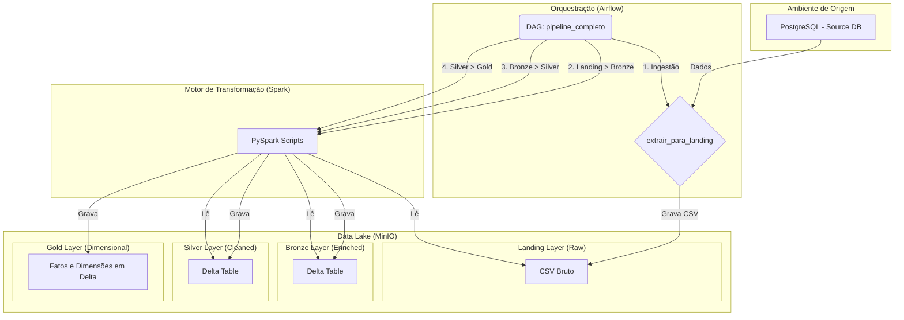

# Arquitetura do Pipeline

A arquitetura do projeto foi desenhada para ser moderna, escalável e baseada em componentes open-source amplamente utilizados no mercado de engenharia de dados. Todos os serviços são containerizados com Docker, garantindo portabilidade e facilidade de configuração.

## Diagrama de Arquitetura

O diagrama abaixo ilustra o fluxo de dados e a interação entre os principais componentes do sistema:

## Componentes

-   **PostgreSQL (Origem):** Simula o banco de dados transacional de um sistema de produção (OLTP), como um e-commerce. É populado com dados falsos (Faker) para simular um ambiente realista.

-   **Apache Airflow:** Atua como o cérebro do pipeline. É o orquestrador responsável por agendar, executar e monitorar as tarefas (DAGs) de forma automática e resiliente.

-   **MinIO (Data Lake):** Um serviço de object storage de alta performance, compatível com a API do Amazon S3. Ele armazena os dados em todas as camadas da arquitetura medalhão.

-   **Apache Spark (PySpark):** O motor de processamento de dados distribuído. É utilizado para executar as transformações (ETL) entre as camadas do Data Lake, desde a limpeza e enriquecimento até a modelagem dimensional.

-   **Delta Lake:** Um formato de armazenamento open-source que traz confiabilidade (transações ACID), performance e funcionalidades de gerenciamento de dados (como `merge`, `time travel`) para o Data Lake. Todas as camadas, exceto a Landing, utilizam o formato Delta.
