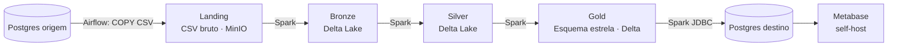

# Arquitetura

O projeto adota a **arquitetura medalhão**, que organiza o Data Lake em camadas
sucessivas de refinamento (Landing → Bronze → Silver → Gold). Cada camada
agrega qualidade e valor ao dado, até a virtualização em um banco relacional
para visualização.

## Fluxo do dado

## Camadas

| Camada  | Formato      | Conteúdo                                                |
| ------- | ------------ | ------------------------------------------------------- |
| Landing | CSV bruto    | Dados exatamente como vieram da origem                  |
| Bronze  | Delta Lake   | Dados padronizados, com auditoria de origem             |
| Silver  | Delta Lake   | Dados limpos, tipados e deduplicados                    |
| Gold    | Delta Lake   | Modelo dimensional (fato + dimensões SCD2)              |

## Componentes

- **Apache Airflow** (Docker, LocalExecutor) — orquestra e agenda a ingestão da
  Landing. O scheduling é do Airflow, sem cron/Agendador do SO.
- **MinIO** (Docker, S3-compatible) — object storage que hospeda o Data Lake.
- **Apache Spark / PySpark** — motor de transformação entre as camadas.
- **Delta Lake** — formato transacional (ACID, MERGE, time travel) das camadas
  Bronze, Silver e Gold.
- **PostgreSQL** — banco de origem (Supabase) e banco de destino da Gold.
- **Metabase** (Docker, self-host) — camada de visualização e dashboards sobre
  a Gold, consumindo o Postgres de destino. Ver [Dataviz (Metabase)](metabase.md).
- **MkDocs (Material)** — esta documentação.

## Jornada do dado

1. **Geração de massa** (Faker) cria os dados de origem — 10 tabelas, 10k+
   linhas, 3 anos de histórico. Ver [Geração de Massa](geracao-massa.md).
2. O **Airflow** ingere os dados brutos do Postgres na **Landing** (CSV no
   MinIO), particionados por data. Ver [Orquestração e Landing](orquestracao.md).
3. O **Spark** lê a Landing e grava a **Bronze** (Delta, com auditoria).
4. O **Spark** limpa, tipa e deduplica, gravando a **Silver** (Delta, via
   MERGE). Ver [Bronze e Silver](bronze-silver.md).
5. O **Spark** modela a **Gold** (esquema estrela) com SCD2 e carga
   incremental, e virtualiza no Postgres de destino. Ver [Gold](gold.md).
6. A Gold alimenta os **dashboards no Metabase** (self-host), conectado ao
   Postgres de destino. Ver [Dataviz (Metabase)](metabase.md).

## Esquema estrela (Gold)

O detalhamento das tabelas de origem e do modelo dimensional está em
[Modelo de Dados](modelo-dados.md).
