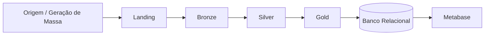

# Data Pipeline

Projeto de **engenharia de dados** que constrói um pipeline completo sobre um
Data Lake usando a **arquitetura medalhão** (Landing → Bronze → Silver → Gold),
com geração de massa de dados, orquestração com Airflow, transformação com
Apache Spark + Delta Lake e disponibilização dos dados finalizados em um banco
relacional para análise no Metabase.

## Visão geral

## Sumário da documentação

- [Arquitetura](arquitetura.md) — as camadas do Data Lake e o fluxo do dado.
- [Modelo de Dados](modelo-dados.md) — tabelas de origem e esquema estrela.
- [Etapas do Projeto](etapas.md) — divisão das tarefas e responsáveis.
- **Pipeline:**
    - [Geração de Massa](geracao-massa.md) — dados de origem com Faker.
    - [Orquestração e Landing](orquestracao.md) — Airflow + MinIO.
    - [Bronze e Silver](bronze-silver.md) — transformação Spark/Delta.
    - [Gold](gold.md) — modelo dimensional, carga incremental e Postgres.
    - [Dataviz (Metabase)](metabase.md) — dashboards self-host sobre a Gold.
- [Como Executar](como-executar.md) — passo a passo para rodar o pipeline.
- [Entrega](entrega.md) — checklist e prazos da entrega final.

## Equipe

| Etapa | Responsável (issue) |
| ----- | ------------------- |
| Data Lake Base | #4 — minattinho |
| Origem dos Dados e Geração de Massa | #2 — AmonAmarth2003 |
| Orquestração e Camada Landing | #5 — p-afonso |
| Transformação Spark (Bronze e Silver) | #6 |
| Modelagem, Carga Incremental e Virtualização (Gold) | #9 |
| Dataviz com Metabase | #10 — Luan-zanardo |
| Documentação, Apresentação e Entrega | #11 — gabrielpagnan |
