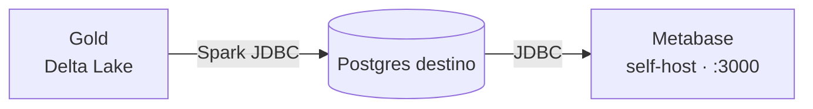

# Dataviz com Metabase (Etapa 6)

A camada de visualização do projeto usa o **Metabase self-host**, rodando em
Docker junto do restante do stack. O Metabase consome o **Postgres de destino**
(Gold virtualizada, produzida pelo `gold_to_postgres.py`) e exibe os dashboards
de análise sobre o modelo dimensional.



## Componentes no Docker

O `docker-compose.yml` adiciona dois serviços para a Etapa 6:

- **`metabase`** — a aplicação Metabase, exposta em
  <http://localhost:3000>.
- **`metabase-db`** — um **Postgres dedicado** que guarda a configuração do
  próprio Metabase (dashboards, perguntas, usuários). Não confundir com o
  banco de **destino** (os dados Gold), que é externo e conectado como
  *data source*.

Os dados do Metabase persistem no volume `metabase-db-data`.

## Subindo o Metabase

```bash
docker compose up -d metabase
# ou suba o stack inteiro:
docker compose up -d
```

Aguarde alguns segundos (o healthcheck do Metabase tem `start_period` de 60s) e
acesse <http://localhost:3000>. No **primeiro acesso**, o Metabase pede a
criação do usuário administrador.

!!! tip "Pré-requisito: Docker Desktop em execução"
    O daemon do Docker precisa estar ativo. No Windows, abra o **Docker
    Desktop** e espere o status ficar **Running** antes de rodar o `docker
    compose`.

## Operação (comandos Docker)

```bash
docker compose ps metabase metabase-db   # status e saúde dos containers
docker compose logs -f metabase          # acompanhar os logs em tempo real
docker compose stop metabase             # parar (mantém os dados no volume)
docker compose up -d metabase            # subir novamente
docker compose down                      # derruba o stack (volumes preservados)
```

Os dashboards, perguntas e usuários do Metabase ficam no volume
`metabase-db-data`, então sobrevivem a `stop`/`down`. Para apagar tudo e
recomeçar do zero, use `docker compose down -v` (remove os volumes).

## Conectando ao banco de destino (data source)

Os dados Gold ficam no **Postgres de destino** definido em `DEST_DB_*` no
`.env`. Configure-o como data source na UI do Metabase:

1. **Configurações → Admin settings → Databases → Add database**.
2. Selecione **PostgreSQL** e preencha com os valores de `DEST_DB_*`:

   | Campo no Metabase | Variável do `.env` |
   | ----------------- | ------------------ |
   | Host              | `DEST_DB_HOST`     |
   | Port              | `DEST_DB_PORT`     |
   | Database name     | `DEST_DB_NAME`     |
   | Username          | `DEST_DB_USER`     |
   | Password          | `DEST_DB_PASSWORD` |

3. Em **SSL**, mantenha habilitado (o destino usa `DEST_DB_SSLMODE=require`).
4. Salve. O Metabase fará a sincronização do schema e as tabelas Gold
   (`fato_vendas`, `dim_cliente`, `dim_produto`, `dim_data`) ficarão
   disponíveis para exploração.

!!! note "Pré-requisito"
    O banco de destino precisa estar populado. Rode antes o
    `src/spark/gold_to_postgres.py` (ver [Gold](gold.md)) para virtualizar a
    Gold no Postgres de destino.

## Montando os dashboards

Com o data source conectado, construa as análises sobre o esquema estrela:

- **Vendas por período** — `fato_vendas` agregada por `dim_data`.
- **Top clientes / produtos** — `fato_vendas` cruzada com `dim_cliente` e
  `dim_produto` (versões vigentes, `is_current = true`).
- **Ticket médio e volume** — métricas sobre o grão de item de pedido.

Use **Browse data** para exploração ad-hoc ou o **editor de perguntas** (visual
ou SQL nativo) e agrupe as visualizações em um **Dashboard**.
