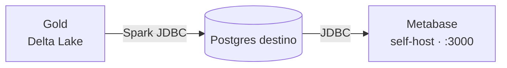

# Dataviz com Metabase (Etapa 6)

A camada de visualização do projeto usa o **Metabase self-host**, rodando em
Docker junto do restante do stack. O Metabase consome o **Postgres de destino**
(Gold virtualizada, produzida pelo `gold_to_postgres.py`) e exibe os dashboards
de análise sobre o modelo dimensional.



## Componentes no Docker

O `docker-compose.yml` adiciona três serviços para a Etapa 6:

- **`metabase`** — a aplicação Metabase, exposta em
  <http://localhost:3000>.
- **`metabase-db`** — um **Postgres dedicado** que guarda a configuração do
  próprio Metabase (dashboards, perguntas, usuários). Não confundir com o
  banco de **destino** (os dados Gold), que é externo e conectado como
  *data source*.
- **`metabase-init`** — um job de execução única que, no primeiro `up`, cria o
  usuário admin, conecta o **data source** (Postgres de destino) e monta o
  **dashboard "Pipeline — Vendas"** (4 KPIs + 2 métricas) via API do Metabase.
  É idempotente: re-execuções não duplicam nada.

Os dados do Metabase persistem no volume `metabase-db-data`.

## Subindo o Metabase

```bash
docker compose up -d metabase
# ou suba o stack inteiro:
docker compose up -d
```

Aguarde alguns segundos (o healthcheck do Metabase tem `start_period` de 60s) e
acesse <http://localhost:3000>. No **primeiro acesso**, o Metabase pede a
criação do usuário administrador.

!!! tip "Pré-requisito: Docker Desktop em execução"
    O daemon do Docker precisa estar ativo. No Windows, abra o **Docker
    Desktop** e espere o status ficar **Running** antes de rodar o `docker
    compose`.

## Operação (comandos Docker)

```bash
docker compose ps metabase metabase-db   # status e saúde dos containers
docker compose logs -f metabase          # acompanhar os logs em tempo real
docker compose stop metabase             # parar (mantém os dados no volume)
docker compose up -d metabase            # subir novamente
docker compose down                      # derruba o stack (volumes preservados)
```

Os dashboards, perguntas e usuários do Metabase ficam no volume
`metabase-db-data`, então sobrevivem a `stop`/`down`. Para apagar tudo e
recomeçar do zero, use `docker compose down -v` (remove os volumes).

## Conexão e dashboard automáticos (metabase-init)

O serviço `metabase-init` provisiona tudo automaticamente no primeiro `up`,
usando as variáveis do `.env`:

- cria o **usuário admin** (`MB_ADMIN_EMAIL` / `MB_ADMIN_PASSWORD`);
- conecta o **data source** "Gold (destino)" com os valores de `DEST_DB_*`
  (o `ssl` é derivado de `DEST_DB_SSLMODE`);
- cria o dashboard **"Pipeline — Vendas"** com 4 KPIs (faturamento total, total
  de pedidos, ticket médio, itens vendidos) e 2 métricas (faturamento por mês e
  top 10 produtos por faturamento).

Acompanhe o provisionamento com:

```bash
docker compose logs -f metabase-init
```

!!! note "Pré-requisito de dados"
    O destino precisa estar populado para os cards exibirem dados. Rode antes o
    `src/spark/gold_to_postgres.py` (ver [Gold](gold.md)). Os cards são criados
    de qualquer forma; só ficam vazios até a Gold ser virtualizada.

### Reconfigurar manualmente (se necessário)

Para refazer o provisionamento do zero, derrube os volumes e suba de novo:

```bash
docker compose down -v
docker compose up -d
```

Ou ajuste o data source / dashboards diretamente pela UI em
**Admin settings → Databases** e na tela de dashboards.

## Montando os dashboards

Com o data source conectado, construa as análises sobre o esquema estrela:

- **Vendas por período** — `fato_vendas` agregada por `dim_data`.
- **Top clientes / produtos** — `fato_vendas` cruzada com `dim_cliente` e
  `dim_produto` (versões vigentes, `is_current = true`).
- **Ticket médio e volume** — métricas sobre o grão de item de pedido.

Use **Browse data** para exploração ad-hoc ou o **editor de perguntas** (visual
ou SQL nativo) e agrupe as visualizações em um **Dashboard**.
