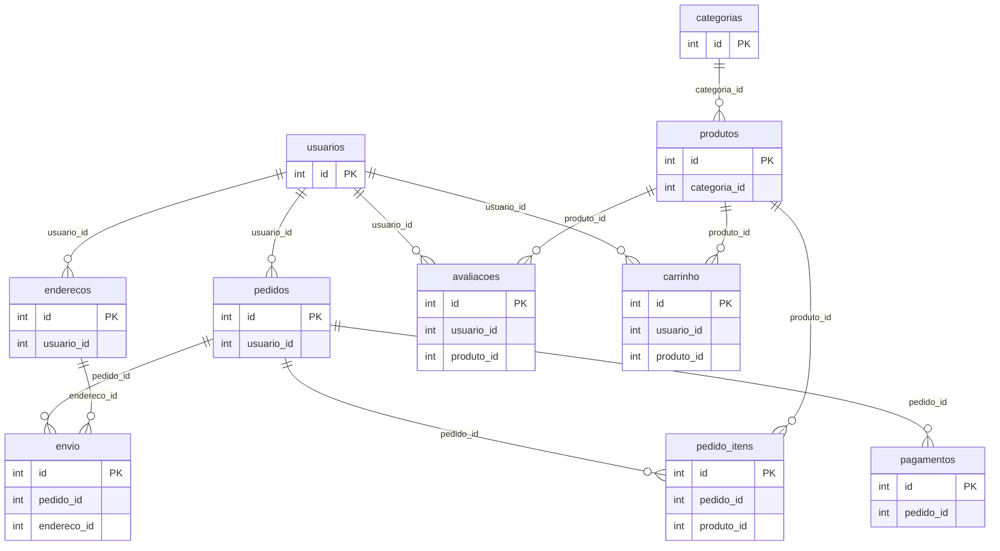
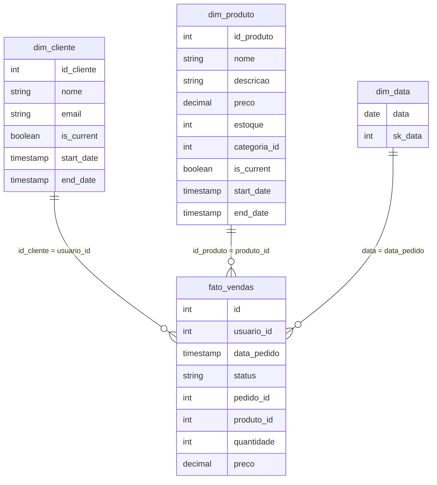

# Modelo de Dados

Esta página descreve as tabelas que o projeto cria e processa no estado atual
do repositório.

## Tabelas de origem

O domínio simulado é um e-commerce. A massa é criada por `src/setup.py`, que
cria 10 tabelas e insere 10.000 linhas em cada uma quando a origem está vazia.

### `usuarios`

| Coluna | Tipo | Descrição |
| ------ | ---- | --------- |
| id | inteiro | Identificador do usuário |
| nome | texto | Nome completo |
| email | texto | E-mail |

### `categorias`

| Coluna | Tipo | Descrição |
| ------ | ---- | --------- |
| id | inteiro | Identificador da categoria |
| nome | texto | Nome da categoria |
| descricao | texto | Descrição da categoria |

### `produtos`

| Coluna | Tipo | Descrição |
| ------ | ---- | --------- |
| id | inteiro | Identificador do produto |
| nome | texto | Nome do produto |
| descricao | texto | Descrição do produto |
| preco | decimal(10,2) | Preço |
| estoque | inteiro | Estoque |
| categoria_id | inteiro | Referência à categoria |

### `pedidos`

| Coluna | Tipo | Descrição |
| ------ | ---- | --------- |
| id | inteiro | Identificador do pedido |
| usuario_id | inteiro | Referência ao usuário |
| data_pedido | timestamp | Data/hora do pedido |
| status | texto | Status do pedido |

### `pedido_itens`

| Coluna | Tipo | Descrição |
| ------ | ---- | --------- |
| id | inteiro | Identificador do item |
| pedido_id | inteiro | Referência ao pedido |
| produto_id | inteiro | Referência ao produto |
| quantidade | inteiro | Quantidade comprada |
| preco | decimal(10,2) | Preço do item |

### `pagamentos`

| Coluna | Tipo | Descrição |
| ------ | ---- | --------- |
| id | inteiro | Identificador do pagamento |
| pedido_id | inteiro | Referência ao pedido |
| forma_pagamento | texto | `cartao_credito`, `boleto` ou `pix` |
| quantia | decimal(10,2) | Valor pago |
| data_pagamento | timestamp | Data/hora do pagamento |

### `envio`

| Coluna | Tipo | Descrição |
| ------ | ---- | --------- |
| id | inteiro | Identificador do envio |
| pedido_id | inteiro | Referência ao pedido |
| endereco_id | inteiro | Referência ao endereço |
| data_envio | timestamp | Data/hora do envio |
| data_entrega | timestamp | Data/hora da entrega, quando houver |
| status | texto | Status do envio |

### `enderecos`

| Coluna | Tipo | Descrição |
| ------ | ---- | --------- |
| id | inteiro | Identificador do endereço |
| usuario_id | inteiro | Referência ao usuário |
| rua | texto | Logradouro |
| cidade | texto | Cidade |
| estado | texto | UF |
| zip_code | texto | CEP |
| pais | texto | País |

### `avaliacoes`

| Coluna | Tipo | Descrição |
| ------ | ---- | --------- |
| id | inteiro | Identificador da avaliação |
| usuario_id | inteiro | Referência ao usuário |
| produto_id | inteiro | Referência ao produto |
| avaliacao | inteiro | Nota |
| comentario | texto | Comentário |
| data_avaliacao | timestamp | Data/hora da avaliação |

### `carrinho`

| Coluna | Tipo | Descrição |
| ------ | ---- | --------- |
| id | inteiro | Identificador do item no carrinho |
| usuario_id | inteiro | Referência ao usuário |
| produto_id | inteiro | Referência ao produto |
| quantidade | inteiro | Quantidade no carrinho |

## MER da origem

O banco de origem representa o domínio transacional do e-commerce. O
`src/setup.py` cria as chaves primárias; as relações abaixo são definidas pelas
colunas de referência usadas na massa gerada. O script não declara constraints
`FOREIGN KEY` no PostgreSQL.

## MER do destino (Modelo Gold)

O script `src/spark/silver_to_gold.py` gera três dimensões e uma fato.

### `dim_cliente` e `dim_produto`

As dimensões mantêm histórico com SCD Tipo 2 usando `is_current`, `start_date`
e `end_date`. O código compara atributos selecionados e cria nova versão quando
há mudança.

### `dim_data`

Contém as datas distintas de `pedidos.data_pedido` e a chave `sk_data` no
formato `yyyyMMdd`.

### `fato_vendas`

A fato é resultado do join entre `pedidos` e `pedido_itens`. Ela é carregada de
forma incremental a partir do checkpoint `gold/_checkpoints/fato_vendas`.

As consultas do Metabase calculam faturamento como `quantidade * preco`.
