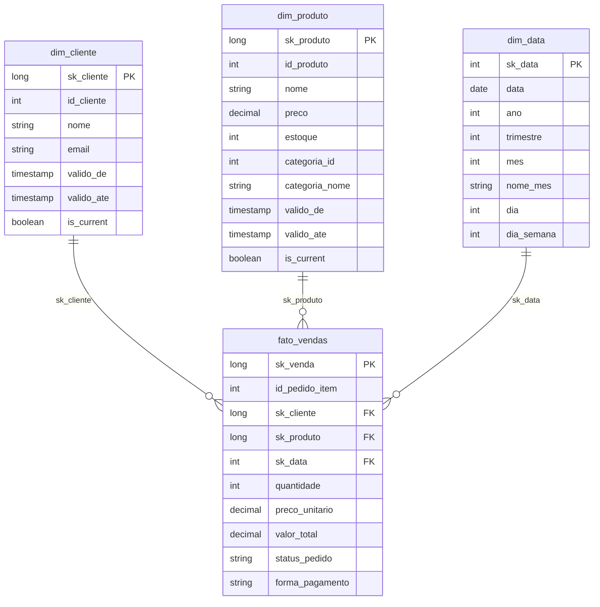

# Modelo de Dados

Esta página documenta os dados que percorrem o pipeline: as **10 tabelas de
origem** (que aterrissam na Landing e seguem até a Silver) e o **modelo
dimensional** (esquema estrela) construído na camada Gold.

## Tabelas de origem

O domínio simulado é um **e-commerce**. São 10 tabelas relacionais, cada uma
com no mínimo 10.000 linhas e datas distribuídas pelos últimos 3 anos
(Etapa 2). Os identificadores (`id`) são as chaves primárias.

### `usuarios`
| Coluna | Tipo | Descrição |
| ------ | ---- | --------- |
| id | inteiro | Identificador do usuário (PK) |
| nome | texto | Nome completo |
| email | texto | E-mail de contato |

### `categorias`
| Coluna | Tipo | Descrição |
| ------ | ---- | --------- |
| id | inteiro | Identificador da categoria (PK) |
| nome | texto | Nome da categoria |
| descricao | texto | Descrição da categoria |

### `produtos`
| Coluna | Tipo | Descrição |
| ------ | ---- | --------- |
| id | inteiro | Identificador do produto (PK) |
| nome | texto | Nome do produto |
| descricao | texto | Descrição do produto |
| preco | decimal(10,2) | Preço unitário |
| estoque | inteiro | Quantidade em estoque |
| categoria_id | inteiro | FK → `categorias.id` |

### `pedidos`
| Coluna | Tipo | Descrição |
| ------ | ---- | --------- |
| id | inteiro | Identificador do pedido (PK) |
| usuario_id | inteiro | FK → `usuarios.id` |
| data_pedido | timestamp | Data/hora do pedido |
| status | texto | Situação (pendente, aprovado, enviado, entregue, cancelado) |

### `pedido_itens`
| Coluna | Tipo | Descrição |
| ------ | ---- | --------- |
| id | inteiro | Identificador do item (PK) |
| pedido_id | inteiro | FK → `pedidos.id` |
| produto_id | inteiro | FK → `produtos.id` |
| quantidade | inteiro | Quantidade comprada |
| preco | decimal(10,2) | Preço unitário no momento da compra |

### `pagamentos`
| Coluna | Tipo | Descrição |
| ------ | ---- | --------- |
| id | inteiro | Identificador do pagamento (PK) |
| pedido_id | inteiro | FK → `pedidos.id` |
| forma_pagamento | texto | cartao_credito, boleto, pix |
| quantia | decimal(10,2) | Valor pago |
| data_pagamento | timestamp | Data/hora do pagamento |

### `envio`
| Coluna | Tipo | Descrição |
| ------ | ---- | --------- |
| id | inteiro | Identificador do envio (PK) |
| pedido_id | inteiro | FK → `pedidos.id` |
| endereco_id | inteiro | FK → `enderecos.id` |
| data_envio | timestamp | Data/hora do envio |
| data_entrega | timestamp | Data/hora da entrega (pode ser nulo) |
| status | texto | preparando, em_transito, entregue, cancelado |

### `enderecos`
| Coluna | Tipo | Descrição |
| ------ | ---- | --------- |
| id | inteiro | Identificador do endereço (PK) |
| usuario_id | inteiro | FK → `usuarios.id` |
| rua | texto | Logradouro |
| cidade | texto | Cidade |
| estado | texto | UF |
| zip_code | texto | CEP |
| pais | texto | País |

### `avaliacoes`
| Coluna | Tipo | Descrição |
| ------ | ---- | --------- |
| id | inteiro | Identificador da avaliação (PK) |
| usuario_id | inteiro | FK → `usuarios.id` |
| produto_id | inteiro | FK → `produtos.id` |
| avaliacao | inteiro | Nota de 1 a 5 |
| comentario | texto | Texto livre |
| data_avaliacao | timestamp | Data/hora da avaliação |

### `carrinho`
| Coluna | Tipo | Descrição |
| ------ | ---- | --------- |
| id | inteiro | Identificador do item no carrinho (PK) |
| usuario_id | inteiro | FK → `usuarios.id` |
| produto_id | inteiro | FK → `produtos.id` |
| quantidade | inteiro | Quantidade no carrinho |

### Dados sujos propositais

O gerador de massa (`generate_mock_landing.py`) injeta de propósito alguns
registros problemáticos nas últimas linhas de cada tabela — IDs duplicados,
nomes vazios, e-mails com espaços/maiúsculas, preços e quantidades negativas,
notas fora do intervalo 1–5, UFs minúsculas. Eles existem para **exercitar as
regras de limpeza e deduplicação da camada Silver** e comprovar que o
tratamento funciona.

## Modelo dimensional (Gold)

A camada Gold materializa um **esquema estrela** com uma tabela fato e três
dimensões.

### `fato_vendas`
Grão: **um item de pedido**. Origem: `pedido_itens` × `pedidos`, enriquecido
com a forma de pagamento. Carregada de forma **incremental** por checkpoint
sobre `data_pedido` (ver [Camada Gold](gold.md)).

| Coluna | Descrição |
| ------ | --------- |
| sk_venda | Chave substituta (surrogate key) da fato |
| id_pedido_item | Chave natural do item (`pedido_itens.id`) |
| sk_cliente | FK → `dim_cliente` (registro vigente no carregamento) |
| sk_produto | FK → `dim_produto` (registro vigente no carregamento) |
| sk_data | FK → `dim_data` (formato `yyyyMMdd`) |
| quantidade | Quantidade do item |
| preco_unitario | Preço unitário |
| valor_total | `quantidade × preco_unitario` |
| status_pedido | Status do pedido |
| forma_pagamento | Forma de pagamento associada ao pedido |

### `dim_cliente` e `dim_produto` (SCD Tipo 2)
Dimensões com **histórico** (Slowly Changing Dimension tipo 2). Cada mudança
de atributo fecha a versão anterior (`valido_ate`, `is_current = false`) e abre
uma nova. A detecção de mudança usa um `hash_scd` (SHA-256) dos atributos
versionados.

| Coluna | Descrição |
| ------ | --------- |
| sk_* | Chave substituta |
| id_* | Chave natural (do registro de origem) |
| valido_de / valido_ate | Janela de vigência da versão |
| is_current | `true` para a versão vigente |

### `dim_data`
Dimensão de calendário gerada entre a menor e a maior `data_pedido` da Silver.
A chave `sk_data` é a data no formato `yyyyMMdd` (ex.: `20260623`).
