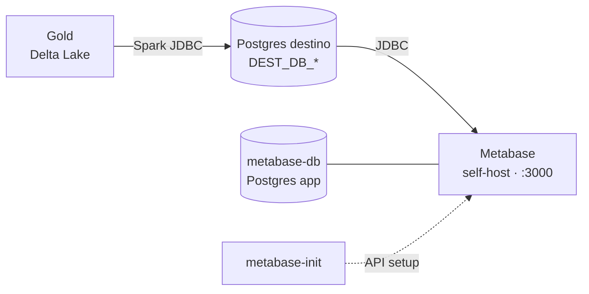

# Metabase (Etapa 6) — Design

**Data:** 2026-06-25
**Status:** Aprovado para implementação

## Contexto

O pipeline produz uma camada **Gold** (Delta Lake) que é virtualizada num
**Postgres de destino** (`DEST_DB_*`) pelo `src/spark/gold_to_postgres.py`. A
Etapa 6 entrega a camada de **visualização** com o **Metabase self-host**,
rodando em Docker junto do restante do stack (MinIO + Airflow).

A documentação (`docs/metabase.md`) e o `.env.example` já descrevem o Metabase,
mas o `docker-compose.yml` ainda **não** contém os serviços. Este design
materializa esses serviços e **automatiza** a conexão do data source.



## Decisões

1. **App DB:** Postgres dedicado (`metabase-db`, `postgres:16`), persistido no
   volume `metabase-db-data`. Guarda dashboards, perguntas e usuários do
   Metabase. Não confundir com o Postgres de **destino** (dados Gold), que é
   externo e conectado como *data source*.
2. **Data source:** **pré-provisionado** automaticamente via API do Metabase
   (não manual pela UI).

## Arquitetura — serviços no `docker-compose.yml`

Três serviços são adicionados:

| Serviço | Imagem | Papel |
| --- | --- | --- |
| `metabase-db` | `postgres:16` | Postgres dedicado do app Metabase. Volume `metabase-db-data`. Healthcheck `pg_isready`. |
| `metabase` | `metabase/metabase:latest` | Aplicação em `:3000`. App DB apontado para `metabase-db` via env `MB_DB_*`. Healthcheck em `/api/health` com `start_period: 60s`. |
| `metabase-init` | `curlimages/curl:latest` | Job de execução única. Espera o `metabase` ficar healthy e provisiona admin + data source via API. `restart: on-failure`. |

### Variáveis de ambiente do serviço `metabase`

Apontam o app DB para o Postgres dedicado (valores vindos do `.env`):

| Env do Metabase | Valor |
| --- | --- |
| `MB_DB_TYPE` | `postgres` |
| `MB_DB_DBNAME` | `${MB_DB_NAME}` |
| `MB_DB_USER` | `${MB_DB_USER}` |
| `MB_DB_PASS` | `${MB_DB_PASSWORD}` |
| `MB_DB_HOST` | `metabase-db` |
| `MB_DB_PORT` | `5432` |

### Dependências (`depends_on`)

- `metabase` depende de `metabase-db` (`condition: service_healthy`).
- `metabase-init` depende de `metabase` (`condition: service_healthy`).

## Pré-provisionamento (serviço `metabase-init`)

Abordagem via **setup-token API** do Metabase — oficial e idempotente. O script
fica embutido no `entrypoint` do serviço, seguindo o mesmo padrão do
`minio-init` já existente no compose.

Fluxo do script:

1. Aguarda o `metabase` responder em `/api/health` (laço `until` com `sleep`,
   além do `depends_on: service_healthy`).
2. `GET /api/session/properties` → extrai o campo `setup-token`.
3. **Se o token existir** (instância nova / não configurada):
   `POST /api/setup` numa única chamada, criando:
   - o usuário **admin** (`MB_ADMIN_EMAIL`, `MB_ADMIN_PASSWORD`, nome do site);
   - o **database de destino** (PostgreSQL) com os valores de `DEST_DB_*`
     (host, port, dbname, user, password, ssl conforme `DEST_DB_SSLMODE`).
4. **Se o token for `null`** (instância já configurada): não faz nada e sai com
   sucesso → **idempotente** em re-execuções (`docker compose up` repetido).

### Payload do `POST /api/setup` (forma)

```json
{
  "token": "<setup-token>",
  "user": {
    "email": "${MB_ADMIN_EMAIL}",
    "password": "${MB_ADMIN_PASSWORD}",
    "first_name": "Admin",
    "last_name": "Pipeline",
    "site_name": "Data Pipeline"
  },
  "prefs": { "site_name": "Data Pipeline", "allow_tracking": false },
  "database": {
    "engine": "postgres",
    "name": "Gold (destino)",
    "details": {
      "host": "${DEST_DB_HOST}",
      "port": "${DEST_DB_PORT}",
      "dbname": "${DEST_DB_NAME}",
      "user": "${DEST_DB_USER}",
      "password": "${DEST_DB_PASSWORD}",
      "ssl": true
    }
  }
}
```

O valor de `ssl` deriva de `DEST_DB_SSLMODE` (`require` → `true`).

## Mudanças no `.env.example`

As vars `MB_DB_NAME/USER/PASSWORD` já existem. Adicionar credenciais do admin:

```dotenv
# ---- Admin inicial do Metabase (provisionado automaticamente) ----
MB_ADMIN_EMAIL=admin@example.com
MB_ADMIN_PASSWORD=metabaseadmin1
```

> Nota: o Metabase exige senha de admin com mínimo de complexidade
> (comprimento e não-trivial). O default acima atende ao requisito.

## Volumes

Adicionar ao bloco `volumes:` do compose:

```yaml
  metabase-db-data:
```

## Tratamento de erros

- **Metabase não sobe a tempo:** `metabase-init` aguarda via `until` +
  `depends_on: service_healthy`; com `restart: on-failure` re-tenta.
- **Re-execução (já configurado):** `setup-token` vem `null` → script sai 0 sem
  reconfigurar (idempotente).
- **Destino indisponível no setup:** o `POST /api/setup` ainda cria admin + a
  entrada do database; a sincronização do schema ocorre quando o destino estiver
  acessível. O destino estar populado (rodar `gold_to_postgres.py` antes) é
  pré-requisito para ver dados, não para subir o serviço.

## Verificação

1. `docker compose up -d metabase metabase-db metabase-init` sobe sem erro.
2. `docker compose ps` mostra `metabase` healthy.
3. `http://localhost:3000` abre **já logado/configurável** com o admin criado
   (não pede setup inicial).
4. Em **Admin → Databases** aparece o data source "Gold (destino)".
5. Re-rodar `docker compose up -d metabase-init` não quebra (idempotente).

## Documentação

Atualizar `docs/metabase.md`: a seção "Conectando ao banco de destino" passa a
descrever que o data source é **provisionado automaticamente** pelo
`metabase-init` (e como reconfigurar manualmente, se necessário), em vez do
passo a passo manual atual.

## Fora de escopo (YAGNI)

- Criação automática de dashboards/perguntas (feito na UI pelo usuário).
- TLS/HTTPS no Metabase, reverse proxy, ou autenticação externa (SSO).
- Backup/restore do `metabase-db`.
