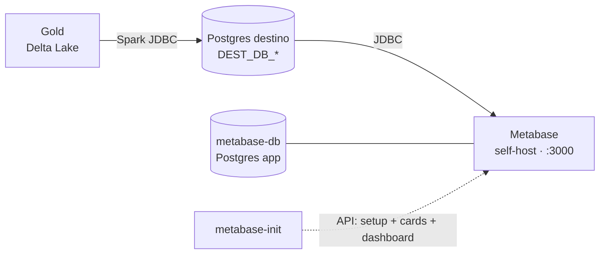

# Metabase (Etapa 6) — Design

**Data:** 2026-06-25
**Status:** Aprovado para implementação

## Contexto

O pipeline produz uma camada **Gold** (Delta Lake) que é virtualizada num
**Postgres de destino** (`DEST_DB_*`) pelo `src/spark/gold_to_postgres.py`. A
Etapa 6 entrega a camada de **visualização** com o **Metabase self-host**,
rodando em Docker junto do restante do stack (MinIO + Airflow).

A documentação (`docs/metabase.md`) e o `.env.example` já descrevem o Metabase,
mas o `docker-compose.yml` ainda **não** contém os serviços. Este design
materializa esses serviços, **automatiza** a conexão do data source e
**provisiona automaticamente** as perguntas (SQL) e um dashboard inicial.



## Decisões

1. **App DB:** Postgres dedicado (`metabase-db`, `postgres:16`), persistido no
   volume `metabase-db-data`. Guarda dashboards, perguntas e usuários do
   Metabase. Não confundir com o Postgres de **destino** (dados Gold), que é
   externo e conectado como *data source*.
2. **Data source:** **pré-provisionado** automaticamente via API do Metabase
   (não manual pela UI).
3. **Dashboard e métricas:** **provisionados automaticamente** via API — **4
   KPIs** (cards escalares) + **2 métricas** (gráficos), em SQL nativo, agrupados
   num dashboard.

## Onde ficam as credenciais do banco de destino

As credenciais do Postgres de destino (que o Metabase consome) **já existem** no
`.env` como `DEST_DB_HOST`, `DEST_DB_PORT`, `DEST_DB_NAME`, `DEST_DB_USER`,
`DEST_DB_PASSWORD` e `DEST_DB_SSLMODE` — as mesmas usadas pelo
`gold_to_postgres.py`. O serviço `metabase-init` recebe essas variáveis pelo
`docker-compose.yml` e as usa para registrar o data source. **Não há novo local
de credenciais**; o usuário preenche o `.env` uma única vez.

## Schema real da Gold (fonte de verdade para o SQL)

> **Atenção:** `docs/modelo_dimensional.md` descreve um modelo idealizado
> (`sk_venda`, `valor_total`, `forma_pagamento`, etc.) que **não** corresponde
> ao que `src/spark/silver_to_gold.py` realmente grava. O SQL provisionado
> abaixo segue o **código real** (fonte de verdade do que existe no Postgres):

| Tabela | Colunas reais (gravadas pelo código) |
| --- | --- |
| `fato_vendas` | `id`, `usuario_id`, `data_pedido`, `status`, `pedido_id`, `produto_id`, `quantidade`, `preco` |
| `dim_cliente` | `id_cliente`, `nome`, `email`, `is_current`, `start_date`, `end_date` |
| `dim_produto` | `id_produto`, `nome`, `descricao`, `preco`, `is_current`, `start_date`, `end_date` |
| `dim_data` | `data`, `sk_data` |

Chaves de junção: `fato_vendas.usuario_id = dim_cliente.id_cliente`,
`fato_vendas.produto_id = dim_produto.id_produto`,
`date(fato_vendas.data_pedido) = dim_data.data`. Valor da linha =
`quantidade * preco` (não há `valor_total` materializado). O
`gold_to_postgres.py` já filtra `is_current = true` ao gravar as dimensões, mas
o SQL mantém o filtro por robustez.

## Arquitetura — serviços no `docker-compose.yml`

Três serviços são adicionados:

| Serviço | Imagem | Papel |
| --- | --- | --- |
| `metabase-db` | `postgres:16` | Postgres dedicado do app Metabase. Volume `metabase-db-data`. Healthcheck `pg_isready`. |
| `metabase` | `metabase/metabase:latest` | Aplicação em `:3000`. App DB apontado para `metabase-db` via env `MB_DB_*`. Healthcheck em `/api/health` com `start_period: 60s`. |
| `metabase-init` | `alpine:3.20` (instala `curl` + `jq` no entrypoint) | Job de execução única. Espera o `metabase` healthy, provisiona admin + data source e cria cards + dashboard via API. `restart: on-failure`. |

### Variáveis de ambiente do serviço `metabase`

Apontam o app DB para o Postgres dedicado (valores vindos do `.env`):

| Env do Metabase | Valor |
| --- | --- |
| `MB_DB_TYPE` | `postgres` |
| `MB_DB_DBNAME` | `${MB_DB_NAME}` |
| `MB_DB_USER` | `${MB_DB_USER}` |
| `MB_DB_PASS` | `${MB_DB_PASSWORD}` |
| `MB_DB_HOST` | `metabase-db` |
| `MB_DB_PORT` | `5432` |

### Variáveis de ambiente do serviço `metabase-init`

`MB_ADMIN_EMAIL`, `MB_ADMIN_PASSWORD` e todas as `DEST_DB_*` (repassadas do
`.env`). Endpoint interno do Metabase: `http://metabase:3000`.

### Dependências (`depends_on`)

- `metabase` depende de `metabase-db` (`condition: service_healthy`).
- `metabase-init` depende de `metabase` (`condition: service_healthy`).

## Pré-provisionamento (serviço `metabase-init`)

O script de provisionamento fica num **arquivo versionado**
`scripts/metabase_provision.sh`, montado no container (mais legível e testável
que um entrypoint inline, dado o tamanho). O entrypoint do serviço instala
`curl` + `jq` e executa o script.

Fluxo:

1. Aguarda o `metabase` responder em `/api/health` (laço `until` + `sleep`,
   além do `depends_on: service_healthy`).
2. **Setup (idempotente):** `GET /api/session/properties` → extrai `setup-token`.
   - **Token presente** (instância nova): `POST /api/setup` numa única chamada,
     criando o **admin** (`MB_ADMIN_EMAIL`/`MB_ADMIN_PASSWORD`) **e** o
     **database de destino** (PostgreSQL, valores `DEST_DB_*`, `ssl` derivado de
     `DEST_DB_SSLMODE`).
   - **Token `null`** (já configurado): pula o setup.
3. **Login:** `POST /api/session` com as credenciais de admin → obtém o
   `X-Metabase-Session` para as chamadas seguintes.
4. **Descobre o database id** do data source via `GET /api/database` (casa pelo
   `name` "Gold (destino)").
5. **Cria os cards e o dashboard (idempotente):** antes de criar, consulta
   `GET /api/dashboard` por nome; se o dashboard "Pipeline — Vendas" já existir,
   pula a criação. Caso contrário, cria os cards (perguntas SQL) e o dashboard,
   e adiciona os cards ao dashboard.

### Idempotência

O setup é gated pelo `setup-token` (null em re-runs). A criação de
cards/dashboard é gated pela existência do dashboard por nome. Assim,
`docker compose up -d metabase-init` repetido não duplica nada e sai com
sucesso.

### Payload do `POST /api/setup` (forma)

```json
{
  "token": "<setup-token>",
  "user": {
    "email": "${MB_ADMIN_EMAIL}",
    "password": "${MB_ADMIN_PASSWORD}",
    "first_name": "Admin",
    "last_name": "Pipeline",
    "site_name": "Data Pipeline"
  },
  "prefs": { "site_name": "Data Pipeline", "allow_tracking": false },
  "database": {
    "engine": "postgres",
    "name": "Gold (destino)",
    "details": {
      "host": "${DEST_DB_HOST}",
      "port": "${DEST_DB_PORT}",
      "dbname": "${DEST_DB_NAME}",
      "user": "${DEST_DB_USER}",
      "password": "${DEST_DB_PASSWORD}",
      "ssl": true
    }
  }
}
```

## Dashboards e métricas automáticas

São criados **6 cards** (SQL nativo) agrupados no dashboard
**"Pipeline — Vendas"**: **4 KPIs** (display `scalar`) + **2 métricas**
(gráficos). SQL conforme o schema real.

### KPIs (display `scalar`)

**KPI 1 — Faturamento total**

```sql
SELECT SUM(f.quantidade * f.preco) AS faturamento_total
FROM fato_vendas f;
```

**KPI 2 — Total de pedidos**

```sql
SELECT COUNT(DISTINCT f.pedido_id) AS total_pedidos
FROM fato_vendas f;
```

**KPI 3 — Ticket médio por pedido**

```sql
SELECT SUM(f.quantidade * f.preco)
       / NULLIF(COUNT(DISTINCT f.pedido_id), 0) AS ticket_medio
FROM fato_vendas f;
```

**KPI 4 — Itens vendidos**

```sql
SELECT SUM(f.quantidade) AS itens_vendidos
FROM fato_vendas f;
```

### Métricas (gráficos)

**Métrica 1 — Faturamento por mês** (display `line`, usa `dim_data`)

```sql
SELECT date_trunc('month', d.data) AS mes,
       SUM(f.quantidade * f.preco)  AS faturamento
FROM fato_vendas f
JOIN dim_data d
  ON d.data = f.data_pedido::date
GROUP BY 1
ORDER BY 1;
```

**Métrica 2 — Top 10 produtos por faturamento** (display `bar`, usa `dim_produto`)

```sql
SELECT p.nome                       AS produto,
       SUM(f.quantidade * f.preco)  AS faturamento
FROM fato_vendas f
JOIN dim_produto p
  ON p.id_produto = f.produto_id AND p.is_current = true
GROUP BY 1
ORDER BY 2 DESC
LIMIT 10;
```

> `dim_cliente` continua disponível no destino para cards futuros (ex.: top
> clientes), fora do escopo inicial destes 6.

Cada card é criado via `POST /api/card` com `dataset_query.type = "native"`,
`dataset_query.database = <id do data source>` e o `display` apropriado
(`scalar` para os KPIs, `line`/`bar` para as métricas). O dashboard é criado via
`POST /api/dashboard` e os cards adicionados via
`POST /api/dashboard/:id/dashcards` (ou o endpoint de dashcards correspondente à
versão do Metabase), com posições em grade (KPIs numa linha superior, gráficos
abaixo).

## Mudanças no `.env.example`

As vars `MB_DB_NAME/USER/PASSWORD` já existem. Adicionar credenciais do admin:

```dotenv
# ---- Admin inicial do Metabase (provisionado automaticamente) ----
MB_ADMIN_EMAIL=admin@example.com
MB_ADMIN_PASSWORD=metabaseadmin1
```

> Nota: o Metabase exige senha de admin com mínimo de complexidade. O default
> acima atende ao requisito.

## Volumes

Adicionar ao bloco `volumes:` do compose:

```yaml
  metabase-db-data:
```

## Tratamento de erros

- **Metabase não sobe a tempo:** `metabase-init` aguarda via `until` +
  `depends_on: service_healthy`; com `restart: on-failure` re-tenta.
- **Re-execução (já configurado):** `setup-token` `null` → pula setup;
  dashboard existente → pula cards/dashboard (idempotente).
- **Destino indisponível / Gold ainda não populada:** setup e criação de cards
  funcionam mesmo assim (são metadados no app DB). Os gráficos só mostram dados
  depois de rodar `gold_to_postgres.py`. O destino populado é pré-requisito para
  **ver dados**, não para subir os serviços.
- **Falha numa chamada de API:** o script usa `set -e` e falha o container
  (`restart: on-failure` re-tenta); erros são logados em `docker compose logs`.

## Verificação

1. `docker compose up -d metabase-db metabase metabase-init` sobe sem erro.
2. `docker compose ps` mostra `metabase` healthy e `metabase-init` concluído
   (exit 0).
3. `http://localhost:3000` abre **já configurado** com o admin (não pede setup).
4. Em **Admin → Databases** aparece o data source "Gold (destino)".
5. O dashboard **"Pipeline — Vendas"** existe com os 6 cards (4 KPIs + 2
   gráficos). Com a Gold populada (após `gold_to_postgres.py`), os cards exibem
   dados.
6. Re-rodar `docker compose up -d metabase-init` não duplica nada (idempotente).

## Documentação

Atualizar `docs/metabase.md`: a seção "Conectando ao banco de destino" passa a
descrever o provisionamento **automático** (data source + dashboard) pelo
`metabase-init`, com instruções de como reconfigurar manualmente se necessário,
em vez do passo a passo manual atual.

## Fora de escopo (YAGNI)

- Cards além dos 6 iniciais (usuário cria mais na UI, ex.: top clientes via
  `dim_cliente`).
- TLS/HTTPS no Metabase, reverse proxy, ou autenticação externa (SSO).
- Backup/restore do `metabase-db`.
- Corrigir a divergência entre `docs/modelo_dimensional.md` e o código (apenas
  registrada aqui; o SQL segue o código real).
